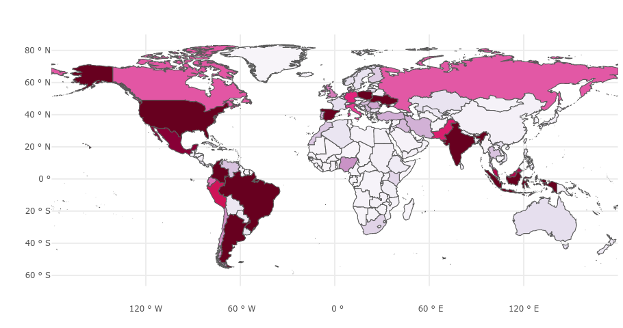

# Github for Research Workshop

Based on data (`ojs-data.csv`) from research with the [Public Knowledge Project](https://doi.org/10.7910/DVN/OCZNVY).

---

Global distribution of 25671 journals actively using OJS:



---

Please cite our work if using this data:

```{bibtex}
@data{DVN/OCZNVY_2021,
author = {Khanna, Saurabh and Raoni, Jonas and Smecher, Alec and Alperin, Juan Pablo and Ball, Jon},
publisher = {Harvard Dataverse},
title = {{Details of publications using software by the Public Knowledge Project}},
UNF = {UNF:6:LIikqmU6NzRu2UKEHiplfw==},
year = {2021},
version = {DRAFT VERSION},
doi = {10.7910/DVN/OCZNVY},
url = {https://doi.org/10.7910/DVN/OCZNVY}
}
```
